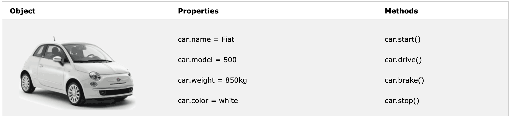

# Introduction

## What's Computer Program
1. A computer program is a list of "instructions" to be "executed" by a computer.
2. In a programming language, these programming instructions are called statements.

## Types of identifier: case sensitive
- Hyphens: eg. `first-name`, `last-name` (Not allowed in JavaScript)
- Underscore: eg. `first_name`, `last_name`
- Upper Camel Case (Pascal Case): eg. `FirstName`, `LastName`
- Lower Camel Case: eg. `firstName`, `lastName`
- Camel Case: `firstName`

## What's JavaScript
- *Case Sensitive* (Recommended to use camel case)
- Important language for web development
  - HTML: define the content of web pages
  - CSS: specify the layout of web pages
  - JavaScript: program the behavior of web pages
   
### Statements
- Values `Literal & Variable`
  - `10.50` or `"Hello World"` => Literal
  - `var x = 0` => Variable
- Operators `+ - * / = == !=` 
- Expressions
  - Combination of values, variables, and operators, which computes to a value.
  - Eg. `"John" + " " + "Doe"`
- Keywords
  - `var`:  identify actions to be performed.
- Comments
  - Double slashes `//` or `between /* and */`
- Identifier
  - The first character must be a letter, or an underscore (_), or a dollar sign ($)
  
### Syntax
- Separate statements using `;`, multiple statements on one line are allowed
  - `a = 5; b = 6; c = a + b;`
- In HTML, the code need to put inside `<script></script>`
- Support external reference `<script src="/js/script.js"></script>`

### Benefit of having external JavaScript
- Separates from HTML
- Easier to read & maintain
- Cached JavaScript files can speed up page loads

### Function
`function` is a block of code that can be executed when "called" for.
``` Javascript
function myFunction() {
 document.getElementById("demo").innerHTML = "Paragraph changed.";
}
```

``` JavaScript
function functionName(parameter1, parameter2, parameter3) {
  // code to be executed
}

// Example
function multiply(p1, p2) {
  return p1 * p2;   // The function returns the product of p1 and p2
}
```

### Used as Variable Values
``` JavaScript
var x = toCelsius(77);
var text = "The temperature is " + x + " Celsius";

var text = "The temperature is " + toCelsius(77) + " Celsius";
```

### Local Variables
``` JavaScript
// code here can NOT use carName

function myFunction() {
  var carName = "Volvo";
  // code here CAN use carName
}

// code here can NOT use carName
```

## Object
``` JavaScript
var person = {
  firstName: "John",
  lastName: "Doe",
  age: 50,
  eyeColor: "blue"
};
```

