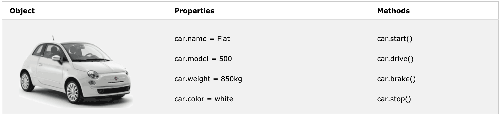

# 19th May 2020

## Recap on last lesson
1. HTML & CSS - Website Development
2. Logic (if, else, while)

## What's Computer Program
1. A computer program is a list of "instructions" to be "executed" by a computer.
2. In a programming language, these programming instructions are called statements.

## Types of identifier: case sensitive
- Hyphens: eg. `first-name`, `last-name` (Not allowed in JavaScript)
- Underscore: eg. `first_name`, `last_name`
- Upper Camel Case (Pascal Case): eg. `FirstName`, `LastName`
- Lower Camel Case: eg. `firstName`, `lastName`
- Camel Case: `firstName`

## What's JavaScript
- *Case Sensitive* (Recommended to use camel case)
- Important language for web development
  - HTML: define the content of web pages
  - CSS: specify the layout of web pages
  - JavaScript: program the behavior of web pages
   
### Statements
- Values `Literal & Variable`
  - `10.50` or `"Hello World"` => Literal
  - `var x = 0` => Variable
- Operators `+ - * / = == !=` 
- Expressions
  - Combination of values, variables, and operators, which computes to a value.
  - Eg. `"John" + " " + "Doe"`
- Keywords
  - `var`:  identify actions to be performed.
- Comments
  - Double slashes `//` or `between /* and */`
- Identifier
  - The first character must be a letter, or an underscore (_), or a dollar sign ($)
  
### Syntax
- Separate statements using `;`, multiple statements on one line are allowed
  - `a = 5; b = 6; c = a + b;`
- In HTML, the code need to put inside `<script></script>`
- Support external reference `<script src="/js/script.js"></script>`

### Benefit of having external JavaScript
- Separates from HTML
- Easier to read & maintain
- Cached JavaScript files can speed up page loads

### Function
`function` is a block of code that can be executed when "called" for.
``` Javascript
function myFunction() {
 document.getElementById("demo").innerHTML = "Paragraph changed.";
}
```

## Operators
### Arithmetic Operators
| Operator | Description |
| --- | --- |
| `+` | Addition |
| `-` | Subtraction |
| `*` | Multiplication |
| `**` | Exponentiation (ES2016) |
| `/` | Division |
| `%` | Modulus (Division Remainder) |
| `++` | Increment |
| `--` | Decrement |

### Assignment Operators
| Operator | Example | Same As |
| --- | --- | --- |
| = | x = y | x = y |
| += | x += y | x = x + y |
| -= | x -= y | x = x - y |
| *= | x *= y | x = x * y |
| /= | x /= y | x = x / y |
| %= | x %= y | x = x % y |
| **= | x **= y | x = x ** y |

### Comparison Operators
| Operator | Description |
| --- | --- |
| == | equal to |
| === | equal value and equal type |
| != | not equal |
| !== | not equal value or not equal type |
| > | greater than |
| < | less than |
| >= | greater than or equal to |
| <= | less than or equal to |
| ? | ternary operator |

### Logical Operators
| Operator | Description |
| --- | --- |
| && | logical and |
| \|\| | logical or |
| ! | logical not |

| Comparison | x | y | Result |
| --- | --- | --- | --- |
| OR | false | false | x \|\| y == false | 
| OR | true | false | x \|\| y == true |
| OR | false | true | x \|\| y == true |
| OR | true | true | x \|\| y == true |
| AND | false | false | x && y == false |
| AND | true | false | x && y == false |
| AND | false | true | x && y == false |
| AND | true | true | x && y == true |
| NOT | true | - | !x == false |
| NOT | false | - | !x == true |


### Type Operators 
| Operator | Description |
| --- | --- |
| typeof | Returns the type of a variable |
| instanceof | Returns true if an object is an instance of an object type |

### Bitwise Operators (Not important)
| Operator | Description | Example | Same as | Result | Decimal |
| --- | --- | --- | --- | --- | --- |
| & | AND | 5 & 1 | 0101 & 0001 | 0001 |  1
| | | OR | 5 | 1 | 0101 | 0001 | 0101 |  5
| ~ | NOT | ~ 5 |  ~0101 | 1010 |  10
| ^ | XOR | 5 ^ 1 | 0101 ^ 0001 | 0100 |  4
| << | Zero fill left shift | 5 << 1 | 0101 << 1 | 1010 |  10
| >> | Signed right shift | 5 >> 1 | 0101 >> 1 | 0010 |   2
| >>> | Zero fill right shift | 5 >>> 1 | 0101 >>> 1 | 0010 |   2

## Data Types
``` JavaScript
var x;           // Now x is undefined
x = 5;           // Now x is a Number
x = "John";      // Now x is a String
```

### String
Text, eg. `"Hello World"`

### Number 
Integer, Float / Double, eg. `123`
  
### Boolean
``` JavaScript
var x = 5;
var y = 5;
var z = 6;
(x == y)       // Returns true
(x == z)       // Returns false
```

### Arrays
- Written with square brackets `[]`
- Separated by commas `,`
- `var cars = ["Saab", "Volvo", "BMW"];`

### Objects
- Written with curly braces `{}`
- name:value pairs, separated by commas
- `var person = {firstName:"John", lastName:"Doe", age:50, eyeColor:"blue"};`

### Undefined
- A variable without a value, Type & values are `undefined`
- `var car;    // Value is undefined, type is undefined`
  
### Empty Value
- Nothing to do with `undefined`
- `var car = "";    // The value is "", the typeof is "string"`
  
### Null: 
- Nothing
- `var person = null;`

### Difference Between `Undefined` and `Null`
- `undefined` and `null` are equal in value but different in type
``` JavaScript
typeof undefined           // undefined
typeof null                // object

null === undefined         // false
null == undefined          // true
```

### Primitive Data
- string
- number
- boolean
- undefined

``` JavaScript
typeof "John"              // Returns "string"
typeof 3.14                // Returns "number"
typeof true                // Returns "boolean"
typeof false               // Returns "boolean"
typeof x                   // Returns "undefined" (if x has no value)
```

### Complex Data
- function
- object

``` JavaScript
typeof {name:'John', age:34} // Returns "object"
typeof [1,2,3,4]             // Returns "object" (not "array", see note below)
typeof null                  // Returns "object"
typeof function myFunc(){}   // Returns "function"
```

## Functions
### Syntax
function functionName(parameter1, parameter2, parameter3) {
  // code to be executed
}

``` JavaScript
function multiply(p1, p2) {
  return p1 * p2;   // The function returns the product of p1 and p2
}
```

### Used as Variable Values
``` JavaScript
var x = toCelsius(77);
var text = "The temperature is " + x + " Celsius";

var text = "The temperature is " + toCelsius(77) + " Celsius";
```

### Local Variables
``` JavaScript
// code here can NOT use carName

function myFunction() {
  var carName = "Volvo";
  // code here CAN use carName
}

// code here can NOT use carName
```

## Object
``` JavaScript
var person = {
  firstName: "John",
  lastName: "Doe",
  age: 50,
  eyeColor: "blue"
};
```

